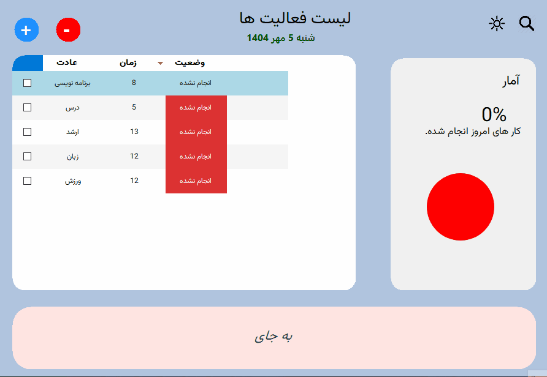

# 🌱 Habit Tracker – Build Your Best Self

A modern **Habit & Daily Task Tracker** built with **C#**, designed not just to organize your routines, but to help you **transform your lifestyle**.
Inspired by the ideas from *Atomic Habits*, *Psycho-Cybernetics*, and *The Compound Effect*, this project combines productivity with self-improvement.

---

## ✨ Core Features

* **Add & Remove Habits / Daily Tasks**

  * Create personalized routines with specific time schedules.
  * Remove or edit habits anytime.

* **Smart Dashboard with Charts**

  * Visual progress tracking with **percentage completion stats**.
  * Clear insights into how consistent you are.

* **Motivational Tips Panel**

  * Rotates powerful quotes & principles from world-famous books:

    * *Atomic Habits*
    * *Psycho-Cybernetics*
    * *The Compound Effect*
    * And more…

* **Calendar & History**

  * Search any date to review completed habits and daily tasks.
  * Perfect for reflection & long-term tracking.

---

## 🎨 UI Highlights

* Beautiful, **user-friendly interface**.
* Clean design with intuitive panels for tasks, tips, and statistics.
* Modern experience with dynamic elements and real-time updates.

---

## 📊 Example Flow

1. Add a habit → e.g., *"Read 20 pages"* at 8:00 PM.
2. Track daily progress → stats & graphs update automatically.
3. Stay inspired → receive rotating motivational notes.
4. Look back → search a date to see your completed tasks.

---

## 🚀 Getting Started

### Prerequisites

* Windows 10/11
* .NET Framework / .NET Core
* Visual Studio

### Installation

1. Clone this repository:

   ```bash
   git clone https://github.com/Arash-zihayat/Habit-Tracker.git
   ```
2. Open the solution in Visual Studio.
3. Build & Run → Start building better habits today.

---

## 📸 Demo



---

## 💡 Why This Project?

Because habits shape who we are.
This isn’t just another to-do list—it’s a **personal growth companion**.

---

## 🗺️ Roadmap

* 🔹 Custom reminders & notifications
* 🔹 Export habit history (CSV/Excel)
* 🔹 Dark/Light themes
* 🔹 AI-generated habit tips

---

## 👨‍💻 Author

**Arash Zihayat**
[GitHub Profile](https://github.com/Arash-zihayat)

---

> *“You do not rise to the level of your goals. You fall to the level of your systems.” – James Clear*
